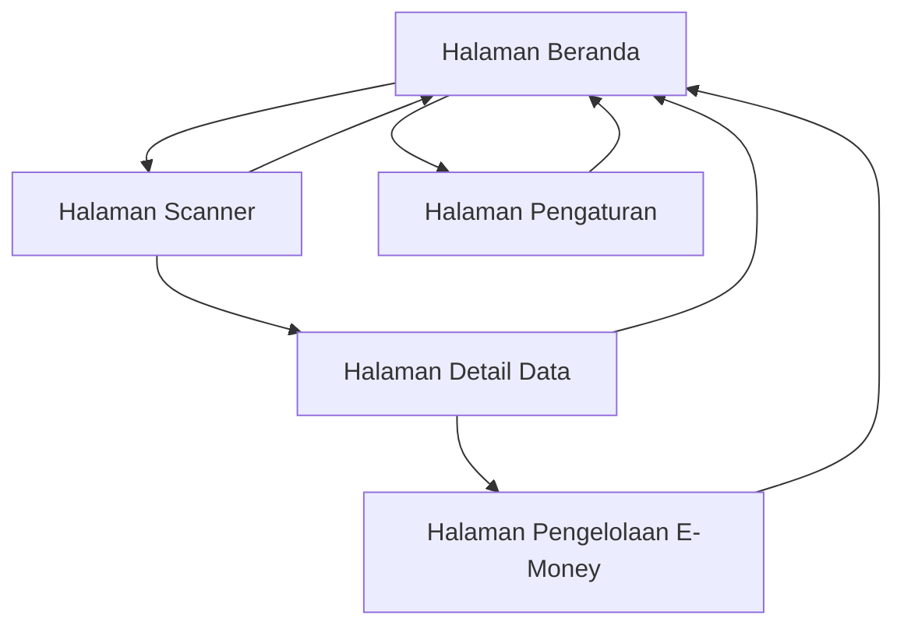

# Dokumen Persyaratan Produk - Aplikasi Pembaca NFC

## 1. Gambaran Produk
Aplikasi pembaca NFC yang sederhana dan intuitif untuk membaca berbagai jenis data NFC termasuk kartu e-money, tag NFC baru, dan data mentah dengan fitur text-to-speech otomatis.
- Memecahkan masalah pembacaan dan pengelolaan data NFC yang kompleks dengan antarmuka yang user-friendly dan aksesibel untuk pengguna umum.
- Target pasar: pengguna smartphone yang membutuhkan solusi pembacaan NFC yang mudah digunakan dengan fitur tambahan text-to-speech untuk aksesibilitas.

## 2. Fitur Utama

### 2.1 Peran Pengguna
| Peran | Metode Registrasi | Izin Utama |
|-------|-------------------|------------|
| Pengguna Umum | Akses langsung tanpa registrasi | Dapat membaca semua jenis data NFC dan menggunakan fitur text-to-speech |
| Pengguna Lanjutan | Aktivasi melalui pengaturan | Dapat memodifikasi saldo kartu e-money dengan batasan keamanan |

### 2.2 Modul Fitur
Persyaratan aplikasi pembaca NFC terdiri dari halaman-halaman utama berikut:
1. **Halaman Beranda**: hero section dengan ilustrasi NFC, navigasi utama, status koneksi NFC.
2. **Halaman Scanner**: area scanning NFC, indikator status pembacaan, hasil pembacaan real-time.
3. **Halaman Detail Data**: tampilan data NFC yang terbaca, opsi text-to-speech, informasi detail kartu.
4. **Halaman Pengelolaan E-Money**: tampilan saldo kartu e-money, opsi modifikasi saldo, riwayat transaksi.
5. **Halaman Pengaturan**: konfigurasi text-to-speech, pengaturan keamanan, preferensi tampilan.

### 2.3 Detail Halaman
| Nama Halaman | Nama Modul | Deskripsi Fitur |
|--------------|------------|------------------|
| Halaman Beranda | Hero Section | Menampilkan ilustrasi NFC yang menarik, status koneksi perangkat NFC, dan navigasi utama dengan animasi glassmorphism |
| Halaman Beranda | Navigasi Utama | Menyediakan akses cepat ke fitur scanner, riwayat pembacaan, dan pengaturan dengan ikon konsisten |
| Halaman Scanner | Area Scanning | Mendeteksi dan membaca data NFC secara real-time dengan feedback visual dan audio |
| Halaman Scanner | Indikator Status | Menampilkan status pembacaan (menunggu, membaca, berhasil, gagal) dengan animasi yang responsif |
| Halaman Detail Data | Tampilan Data | Menampilkan data NFC yang terbaca dalam format yang mudah dibaca dengan tipografi yang jelas |
| Halaman Detail Data | Text-to-Speech | Membacakan data NFC secara otomatis dengan kontrol volume dan kecepatan |
| Halaman Pengelolaan E-Money | Tampilan Saldo | Menampilkan saldo kartu e-money dengan format mata uang yang sesuai |
| Halaman Pengelolaan E-Money | Modifikasi Saldo | Memungkinkan pengguna lanjutan memodifikasi saldo dengan verifikasi keamanan berlapis |
| Halaman Pengaturan | Konfigurasi Audio | Mengatur preferensi text-to-speech, volume, dan bahasa |
| Halaman Pengaturan | Keamanan | Mengelola izin modifikasi saldo dan pengaturan keamanan lainnya |

## 3. Proses Utama

**Alur Pengguna Umum:**
Pengguna membuka aplikasi → melihat halaman beranda dengan status NFC → menuju halaman scanner → mendekatkan kartu/tag NFC → melihat hasil pembacaan di halaman detail → mendengarkan pembacaan otomatis melalui text-to-speech → kembali ke beranda atau melakukan scanning ulang.

**Alur Pengguna Lanjutan:**
Pengguna mengaktifkan mode lanjutan di pengaturan → melakukan scanning kartu e-money → melihat detail saldo → memilih opsi modifikasi saldo → memasukkan verifikasi keamanan → mengonfirmasi perubahan → melihat hasil modifikasi.

## 4. Desain Antarmuka Pengguna

### 4.1 Gaya Desain
- **Warna Utama dan Sekunder**: #E8F4FD (biru pastel utama), #F0E8FF (ungu pastel sekunder), #E8F8F0 (hijau pastel aksen)
- **Gaya Tombol**: Rounded dengan efek glassmorphism, border subtle, dan shadow yang halus
- **Font dan Ukuran**: Inter atau Poppins, ukuran 16px untuk body text, 24px untuk heading, 14px untuk caption
- **Gaya Layout**: Card-based dengan glassmorphism effect, navigasi top dengan blur background
- **Saran Emoji/Ikon**: Menggunakan ikon outline dengan style konsisten, emoji untuk feedback positif (✅, 📱, 💳)

### 4.2 Gambaran Desain Halaman
| Nama Halaman | Nama Modul | Elemen UI |
|--------------|------------|----------|
| Halaman Beranda | Hero Section | Background gradient pastel, card glassmorphism dengan blur 20px, shadow soft rgba(0,0,0,0.1), ilustrasi NFC 3D dengan animasi floating |
| Halaman Scanner | Area Scanning | Circular scanning area dengan border animated, glassmorphism overlay, pulse animation saat scanning, color feedback (biru→hijau→merah) |
| Halaman Detail Data | Tampilan Data | Card layout dengan backdrop-filter blur, padding 24px, rounded corners 16px, text hierarchy dengan Inter font |
| Halaman Pengelolaan E-Money | Tampilan Saldo | Large typography untuk saldo, glassmorphism card dengan gradient border, micro-interactions pada hover/tap |
| Halaman Pengaturan | Konfigurasi | Toggle switches dengan glassmorphism effect, slider components dengan pastel colors, grouped settings dalam cards |

### 4.3 Responsivitas
Aplikasi dirancang mobile-first dengan adaptasi desktop, mengoptimalkan interaksi touch dengan area tap minimum 44px, dan mendukung gesture swipe untuk navigasi antar halaman.