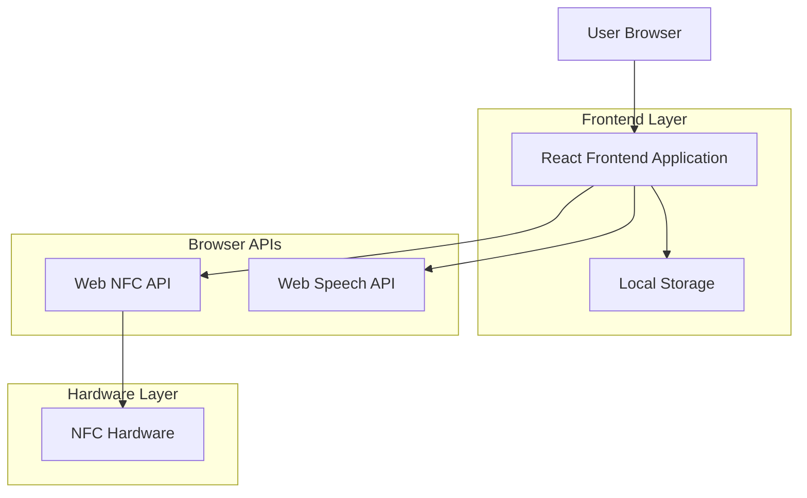
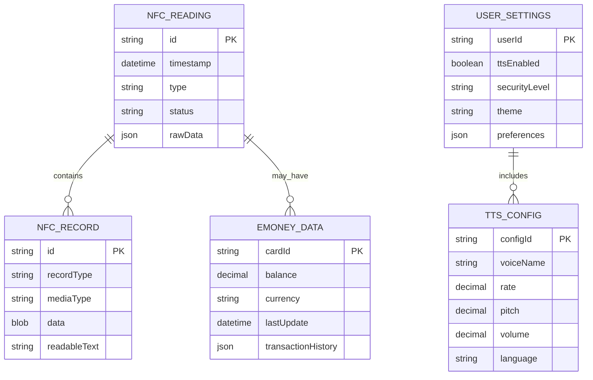

# Dokumen Arsitektur Teknis - Aplikasi Pembaca NFC

## 1. Desain Arsitektur



## 2. Deskripsi Teknologi

* Frontend: React\@18 + TypeScript + Tailwind CSS\@3 + Vite

* APIs: Web NFC API, Web Speech API

* Storage: Local Storage untuk pengaturan dan riwayat

* Styling: Tailwind CSS dengan custom glassmorphism utilities

## 3. Definisi Route

| Route       | Tujuan                                                           |
| ----------- | ---------------------------------------------------------------- |
| /           | Halaman beranda, menampilkan status NFC dan navigasi utama       |
| /scanner    | Halaman scanner NFC dengan area pembacaan real-time              |
| /detail/:id | Halaman detail data NFC yang terbaca dengan fitur text-to-speech |
| /emoney     | Halaman pengelolaan kartu e-money dan modifikasi saldo           |
| /settings   | Halaman pengaturan aplikasi, audio, dan keamanan                 |

## 4. Definisi API

### 4.1 Core API

**Web NFC API Integration**

```typescript
interface NFCReadingEvent {
  message: {
    records: NFCRecord[];
  };
}

interface NFCRecord {
  recordType: string;
  data: ArrayBuffer;
  id?: string;
  mediaType?: string;
}

interface EMoney {
  cardId: string;
  balance: number;
  currency: string;
  lastTransaction?: Date;
}
```

**Text-to-Speech Integration**

```typescript
interface SpeechConfig {
  voice: SpeechSynthesisVoice;
  rate: number;
  pitch: number;
  volume: number;
  lang: string;
}

interface TTSService {
  speak(text: string, config?: SpeechConfig): void;
  stop(): void;
  pause(): void;
  resume(): void;
}
```

**Local Storage Schema**

```typescript
interface AppSettings {
  ttsEnabled: boolean;
  ttsConfig: SpeechConfig;
  securityLevel: 'basic' | 'advanced';
  theme: 'light' | 'dark' | 'auto';
}

interface NFCHistory {
  id: string;
  timestamp: Date;
  type: 'emoney' | 'tag' | 'raw';
  data: any;
  readable: string;
}
```

## 5. Arsitektur Server

Tidak diperlukan arsitektur server karena aplikasi berjalan sepenuhnya di browser menggunakan Web APIs.

## 6. Model Data

### 6.1 Definisi Model Data



### 6.2 Local Storage Schema

**Settings Storage**

```typescript
// localStorage key: 'nfc-app-settings'
const defaultSettings = {
  ttsEnabled: true,
  ttsConfig: {
    rate: 1.0,
    pitch: 1.0,
    volume: 0.8,
    lang: 'id-ID'
  },
  securityLevel: 'basic',
  theme: 'auto',
  autoSpeak: true,
  scanHistory: true
};
```

**History Storage**

```typescript
// localStorage key: 'nfc-app-history'
interface HistoryEntry {
  id: string;
  timestamp: number;
  type: 'emoney' | 'tag' | 'raw';
  data: {
    cardId?: string;
    balance?: number;
    currency?: string;
    rawData: string;
    readableText: string;
  };
  favorite: boolean;
}
```

**E-Money Cache**

```typescript
// localStorage key: 'nfc-app-emoney'
interface EMoneyCache {
  [cardId: string]: {
    balance: number;
    currency: string;
    lastRead: number;
    cardType: string;
    nickname?: string;
  };
}
```

